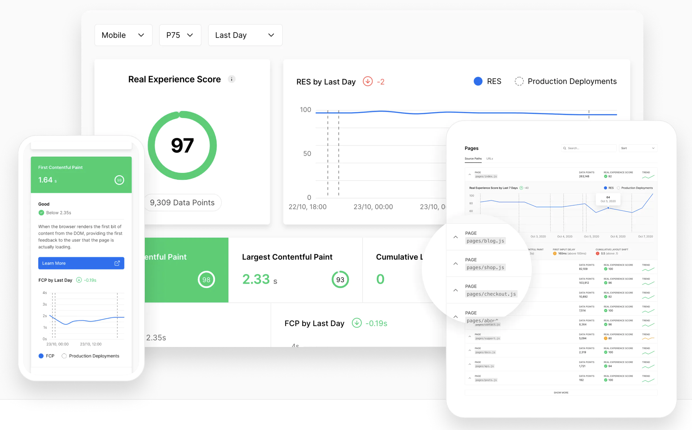
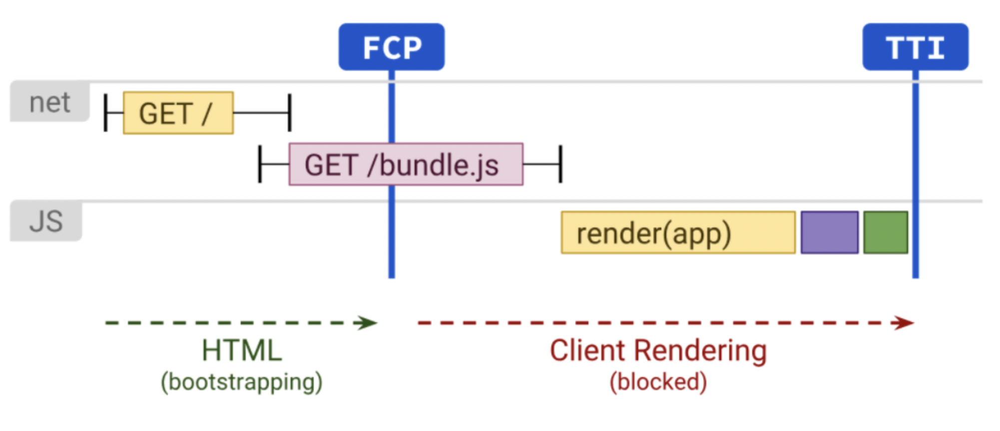
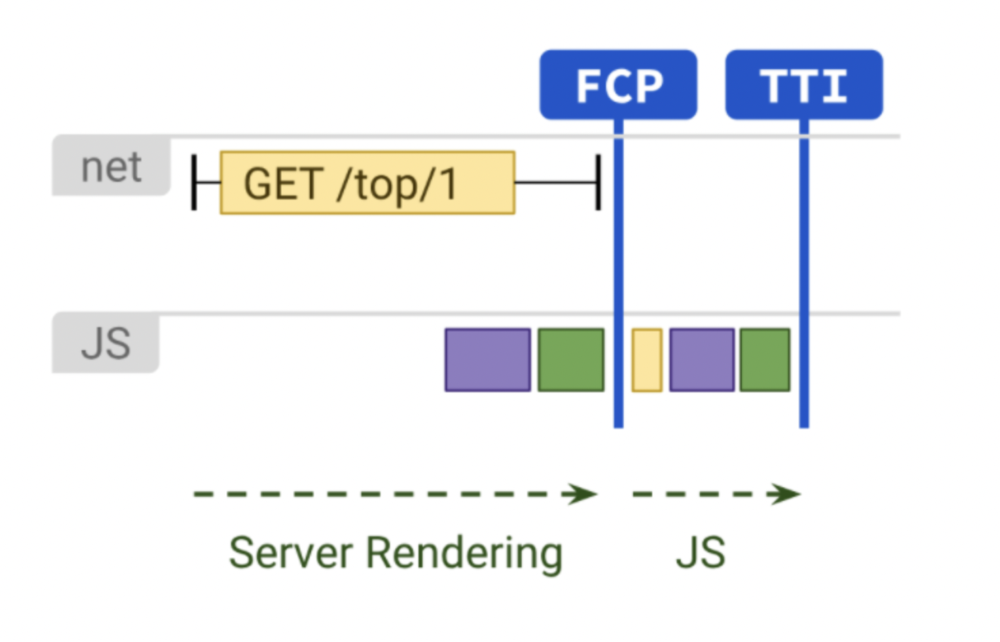
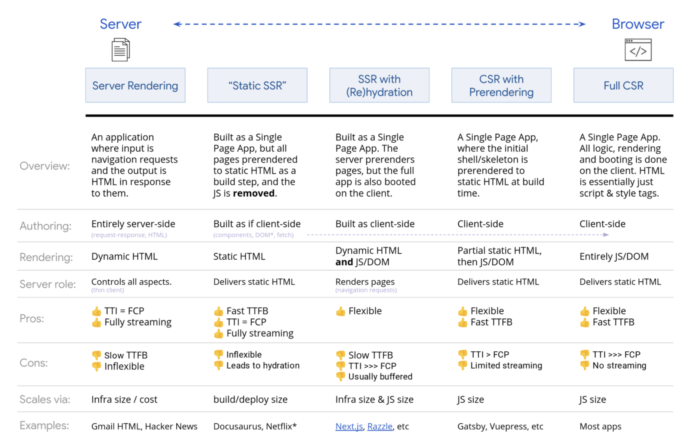

# Next.js 🙂

Created: Jun 18, 2021 10:02 AM

# Next.js

Next.js는 2016년에 Vercel 이라는 곳에서 처음 만든 **React 프론트엔드 웹 프레임워크**입니다.

## 왜 Next.js 을 쓸까?

### 이미지 최적화

이미지 컴포넌트 `next/image` 를 만들었습니다. 모던 웹에 잘 맞습니다.

**이미지 리사이즈, 최적화, `WebP`와 같은 모던 포맷을 제공**합니다. 이것이 이미지 자동 최적화입니다.

- WebP 는 PNG, JPEG 보다 컬러의 깊이감, 애니메이션 프레임, 불투명도 등에서 더 나은 압축 방식입니다. 크롬, 엣지, 파이어폭스, 오페라, 사파리에서 지원해요. ~~인터넷익스플로러 안녕~~
- 화면의 표시 영역(viewport)이 작다면 그에 맞춰 굳이 큰 이미지를 보이지 않도록 합니다.
- 외부에서 이미지를 가져오더라도 다 동작 합니다.

`Webpack` 의 경우 이미지 최적화는 빌드 시에 수행되는데, `Next.js` 에서는 유저가 **요청**할 때, 즉 수요에 맞추어 최적화 합니다. 따라서 일반적인 정적 사이트를 만드는 툴과 다르게 `Next.js` 의 빌드 시간은 이미지 개수에 영향을 받지 않습니다.

이미지는 디폴트로 **lazy loading** 됩니다. 스크롤해서 viewport에 들어와 있는 이미지들이 로드됩니다.

- lazy loading?

  Viewport를 벗어난 영역에서의 이미지는 좀 늦게 불러오고 빨리 웹사이트를 띄우는 것을 말합니다.

  

- 예시 코드

  ```jsx
  import Image from "next/image";

  function Home() {
    return (
      <>
        <h1>My Homepage</h1>
        <Image
          src="/me.png"
          alt="Picture of the author"
          width={500}
          height={500}
        />
        <p>Welcome to my homepage!</p>
      </>
    );
  }

  export default Home;
  ```

### Internationalized 라우팅

`Next.js` 에는 **국제화 라우팅**이 기본으로 탑재되어 있습니다.

`apple.com/kr/mac` 과 같이 중간에 지역을 새겨주는데 이게 자동으로 되는거죠. `next/link` 와 `next/router` 를 사용하여, 서로 다른 locale에서 링크 타고 왔다갔다 하기도 용이합니다.

- Link 예시

  ```jsx
  import Link from "next/link";

  export default function IndexPage(props) {
    return (
      <Link href="/another" locale="fr">
        <a>To /fr/another</a>
      </Link>
    );
  }
  ```

아니면 도메인 자체도 바꿔주도록 설정할 수 있습니다. (.com, .kr, .fr ...)

### 방문자 데이터 분석

`Lighthouse score` 로 분석할 수 있도록 제공합니다.

- `Lighthouse score`란? 크롬에서 만든 오픈소스 분석툴 `Lighthouse` 에서의 성능지표
  

### 초기 환경 설정은 알아서

**컴파일과 번들링을 자동**으로 해줍니다. **프로덕션**을 위해서도 알아서 **최적화** 해줍니다. 🥳

### SSG(Static Site Generation), SSR(Server Side Rendering) 하이브리드

클라이언트는, 서버로 브라우저에 표시할 내용을 요청해서, 받아옵니다. 이 표시하는 동작을 **렌더링**이라고 합니다.

`Next.js` 에서는 세 가지 렌더링 방법을 제공합니다.

1. **빌드 시에 데이터**를 가지고 오는, **SSG** `getStaticProps`

   - 빌드 때만 실행되기 때문에 요청 때는 데이터를 가져오지 않습니다. 무슨 데이터냐면, 쿼리 값이나 HTTP 헤더같은거요.
   - 서버사이드 코드를 바로 작성해도 됩니다.

     `getStaticProps` 는 서버에서만 실행됩니다. 클라이언트 노노. 클라이언트가 받게 되는 JS 번들에도 이 함수는 포함되지 않아요. 그래서 그냥 서버사이드 코딩에서 하는 일인, 데이터베이스 쿼리 같은것도 이 함수에 적어도 됩니다.

   - 이럴 때 `getStaticProps` 를 사용하면 좋습니다.
     - 렌더링할 때 필요한 데이터가, 유저 요청에 앞서 빌드할 때 처리해도 되는 경우
     - 공개적으로 캐싱되도 되는 데이터인 경우
     - 검색 엔진 목적으로 렌더링이 되어야하고 매우 빨라야할 때- 이 함수로 데이터 불러온 결과값은 JSON 파일로 만들어져서 캐싱되고, HTML도 캐싱되거든요.

2. 데이터에 따라서, 기본 렌더링된 페이지에 동적 라우팅을 명시하는, SSG `getStaticPaths`
   - 동적 라우팅? `pages/post/[pid]`
   - Next.js가 모든 명시된 경로를 pre-render 해줍니다.
   - 같은 SSG인 `getStaticProps` 와 함께 쓰면 되고, `getServerSideProps` 와는 쓸 수 없어요.
   - `getStaticProps` 와 마찬가지로, 빌드 시에만 실행됩니다.
   - 언제 `getStaticPath` 를 사용하면 좋을까요?
     - 정적으로 pre-rendering된 페이지를 쓰는데, 거기에 동적 라우팅이 들어간 경우
3. **클라이언트의 요청 때마다 데이터**를 얹어주는, SSR `getServerSideProps`
   - 언제 `getServerSideProps` 를 사용하면 좋을까요?
     - 페이지는 미리 만들어두되 그 위에 올라가는 데이터는 클라이언트 요청을 받을 때 가져와야 하는 경우에만 사용합니다.
     - 추가 설정 없이는 결과가 캐싱되지 않습니다.
     - 로딩 초기에는 `getStaticProps` 보다는 느립니다. 서버가 매 요청시마다 결과를 완성시켜줘야하기 때문이죠.
   - 브라우저에서 돌지 않는 함수입니다. 오직 서버에서만 실행됩니다.
     - 페이지를 요청하면, 요청한 즉시 실행되며, 페이지는 일부 먼저 렌더링이 됩니다.

### Incremental Static Regeneration

빌드 후에 정적 페이지를 새로 만들거나 기존 페이지를 업데이트하고 싶을 때, 전체 사이트를 리빌드하지 않고 해당 부분만 업데이트할 수 있습니다.

### 타입스크립트 서포트

설정도 자동으로 가능합니다.

### Hot Reloading

Live Editing; 실시간 수정이 됩니다.

### 파일시스템 기반 라우팅

예를 들어 `pages/demo` 폴더 안에 `product.js`, `supplier.js` 페이지가 있는 경우, `/demo/product`, `demo/supplier` 로 URL 접근할 수 있습니다.

### API 제작 가능

백엔드 담당인 API도 만들 수 있습니다.

### CSS, Sass 지원

별도의 설정 없이 컴포넌트 단위로 CSS, Sass를 사용할 수 있습니다.

### 코드 스플리팅, 번들링 최적화

크롬 팀에서 만든 코드 스플리팅, 번들링 최적화 알고리즘을 사용합니다.

## CSR vs SSR

### 클라이언트사이드 렌더링(CSR)



FCP: First Contentful Paint

TTI: Time To Interactive

만약 클라이언트가 렌더링을 진행한다면 어떻게 될까요?

- **첫 요청시에 한 페이지만** 불러오게 됩니다.
- **초기 로딩 이후로 웹사이트 렌더링이 빠릅니다.**
- 사이트 간 상호 작용도 활발하고, 자바스크립트 라이브러리를 잘 활용하기 때문에 유저 모션에도 민감하게 반응할 수 있죠.
- 하지만 단점이 있습니다.
  - **초기 페이지 로딩이 느립니다.**
    - html이 있고, 그 위에 javascript 코드가 올라가고, 이 javascript 코드가 실행되고, 그 코드 안에서 서버 요청도 대기타야되고, UI 꾸미는 코드 있으면 그것도 기다려야 하기 때문입니다.
    - 대부분 추가적인 라이브러리를 필요로 합니다.
  - **검색 엔진 최적화가 어렵습니다.**
    - 검색 엔진이 response로 받게 되는 사이트들이 js로 렌더링 되어야 하는 상태, 컨텐츠가 텅 빈상태니까, 이부분에서 최적화가 어렵습니다.

### 서버사이드 렌더링(SSR)



서버에서 렌더링을 수행한다면 어떻게 될까요?

- 완성된 페이지 형태로 클라이언트에 던져줍니다. 따라서, 페이지를 이동할 때마다 새로운 페이지를 요청합니다.
- **검색 엔진 최적화**(Search Engine Optimization; SEO)가 가능합니다.
- 렌더링해둔 html을 클라이언트에게 던져주기 때문에, **초기 로딩 속도를 많이 줄여줍니다.**
- 이것도 장점만 있지는 않죠. 😢
  - 일단 개발 난이도가 올라가고,
  - **잦은 서버 렌더링 요청**이 생기기 때문에, 부하가 발생합니다.
  - **페이지 요청마다 새로고침이 발생**합니다. 페이지 이동시에 화면이 깜빡거릴 수 있습니다.
  - **전체적으로 페이지 렌더링은 느립니다.**



> 따라서, 서비스의 기능과 목적에 맞게 적절한 렌더링 위치를 결정해야 합니다!
