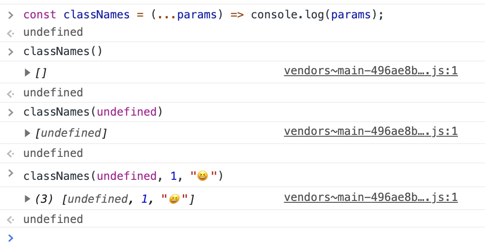

# TypeScript/ES6+ 에서 arguments를 Rest parameter로 활용, 확장성 높은 함수만들기

여러분 [classnames](https://www.npmjs.com/package/classnames) 란 패키지 아세요?

리액트 컴포넌트의 className 속성에 들어가는 값들을 객체, 배열 형식으로 넣게 도와주는 도구인데, 저는 기능 자체는 아주 간단한데 굳이 설치해야할 필요성을 못 느껴서 직접 만들어서 써왔어요.

그러다가 조금 더 확장성있고 깔끔하게 개선하고 싶어서 이번에 만지다가 깨달은 것을 공유하고자 합니다.

## Legacy code

```tsx
export const classNames = (
  className: string | undefined | (string | undefined)[]
): string | undefined => {
  if (Array.isArray(className)) {
    return className.filter((cn) => !!cn).join(" ");
  } else {
    return className;
  }
};

// 활용 예시
<Component className={classNames([state1, state2])} />;
```

저는 이렇게 만들어서 써왔는데 제가 쓰고자 했던 목적은 다음과 같았어요.

1. 쓸 데 없이 속성이 html문에 포함되지않도록(`class=""`) 전달하는 파라미터가 undefined 일경우 undefined가 되게 한다.
2. 글자 그대로를 넣을 수 있다.
3. 여러 클래스명을 받을 경우 배열로 오로지 undefined가 아닌 값들만 모아 나타낸다.

그러다가 이번에 함수를 개선하기 위해서 `arguments` 라는 것을 써보기로 했어요.

## `arguments` 에 대해

`arguments` 는 함수에 전달된 인수들을 담은 자바스크립트가 예약해놓은 객체에요. 함수 내에서 쓸 수 있고 로컬 변수입니다. 사용법은 아래를 봐보세요. 저는 미리 정해지지 않은 n개의 인수를 확장성있게 받기 위해 이것을 사용하려고 했어요.

```tsx
function func1(a, b, c) {
  console.log(arguments[0]);
  // expected output: 1

  console.log(arguments[1]);
  // expected output: 2

  console.log(arguments[2]);
  // expected output: 3
}

func1(1, 2, 3);
```

## ES6+ 에서 `arguments` 의 사용

다만 mdn 에도 나와있듯 ES6 이상에서는 Rest parameter를 쓰는 것을 권장하고 있어요. 사실 arguments는 예약된 이름이라 혼동을 줄 수도 있고, 우리가 따로 타입지정을 하지 않았는데 로컬변수로 만들어지는 객체라 때에 따라선 오히려 가독성과 유지 보수를 해칠 수도 있어요.

## Rest parameter 적용

제가 만들었던 classNames를 Rest parameter로 인수를 고쳐보면 다음과 같을 거에요.(타입과, 기능은 조금 있다 살펴볼게요)

```tsx
const classNames = (...params) => console.log(params);
```

실제로 params가 인수의 타입과 갯수에 따라 어떻게 달라지는지 볼까요?



아주 직관적으로 변해요. 기본적으로 언제나 Array임을 보장합니다. 인수가 없으면 length가 0인 배열이 되는거죠. 또한 각 인수의 위치에 맞게 각 배열의 인덱스로 들어갑니다.

이제 여기에 타입을 지정해볼게요.

## Type 적용

```tsx
const classNames = (...params: (string | undefined)[]) => console.log(params);
```

Rest paramter의 타입은 어떻게 지정하면될까요? 기존 인수들 타입 설정하듯 똑같이 하면되요. 다만 이친구는 배열이라는 것을 인지하고, 파라미터로

저는 각 인자로 className에 들어갈 녀석들을 받을 것이기 때문에 string 타입, 그리고 변수를 인자로 받을 경우 해당 변수가 undefined일 땐 일부러 포함시키지 않으려고 undefined도 넣어줬어요.

## 최종적으로 개선한 함수

```tsx
export const classNames = (...names: (string | undefined)[]) =>
  names.filter((n) => !!n).join(" ") || undefined;
```

최종적으로 위와 같은 모습이 되었는데, 저는 인수가 없거나, 모든 인수가 undefined일 경우 undefined가 리턴되도록 했어요. 그렇게 하면 리액트 컴포넌트는 `class=""` 를 html 태그에 붙이지 않게 되거든요.

그걸 파악하는 조건으로 나머지 인수로 들어올 names는 배열이라는 점, ""나 undefined가 아닌 텍스트인 것만 남겨야 한다는 점, 그리고 빈 배열에 조인을 하면 "" 가 나오므로 falsy 한 속성을 이용해서 || 연산자로 undefined가 되게했어요.

이렇게 해서 제가 원하는 모든 기능을 충족하고, 아주 가볍고 심플한 classNames 함수를 TypeScript와 ES6+에 맞게 작성했습니다!

## References

[arguments 객체 - JavaScript | MDN](https://developer.mozilla.org/ko/docs/Web/JavaScript/Reference/Functions/arguments)
