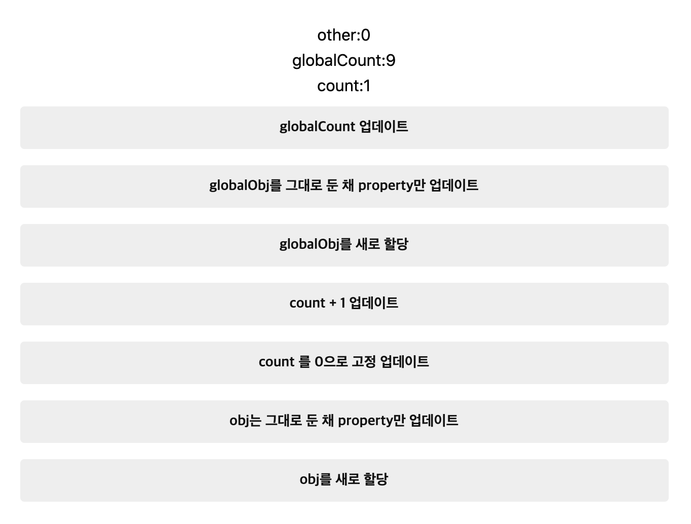

# React의 Deps에 대하여(feat. Object.is)

많은 경우 우리는 선택적인 side effect 로직을 실행하기 위해서 hook에 `deps(React.DependencyList`) 를 전달합니다.

그런데 `deps` 에 전달된 변수들은 어떠한 비교로직을 통해 상태가 변경되었다고 판단할까요?

결론부터 말하면 `deps` 는 `[Object.is](http://object.is)` 로 비교됩니다. 이게 중요합니다.

### 여러가지 테스트

```tsx
let globalCount = 0;
let globalObj = { n: 3 };
function initOth
er(initialOther?: number) {
  console.log("initOther executed...");
  return initialOther !== undefined ? initialOther + 1 : 0;
}
export default function Page({ initialOther }: { initialOther?: number }) {
  console.log("Page rendered...");
  const [count, setCount] = useState(0);
  const [other] = useState(() => initOther(initialOther));
  const [obj, setObj] = useState<any>({ n: 3 });
  useEffect(() => {
    console.log({ globalCount });
  }, [globalCount]);
  useEffect(() => {
    console.log({ globalObj });
  }, [globalObj]);
  useEffect(() => {
    console.log("globalObj.n", globalObj.n);
  }, [globalObj.n]);
  useEffect(() => {
    console.log({ count });
  }, [count]);
  useEffect(() => {
    console.log({ obj });
  }, [obj]);
  useEffect(() => {
    console.log("obj.n", obj.n);
  }, [obj.n]);
  return (
    <Wrapper>
      <p>other:{other}</p>
      <p>globalCount:{globalCount}</p>
      <p>count:{count}</p>
      <Button onClick={() => globalCount++}>globalCount 업데이트</Button>
      <Button onClick={() => globalObj.n++}>
        globalObj를 그대로 둔 채 property만 업데이트
      </Button>
      <Button
        onClick={() => {
          globalObj = { n: 3 };
        }}
      >
        globalObj를 새로 할당
      </Button>
      <Button onClick={() => setCount(count + 1)}>count + 1 업데이트</Button>
      <Button onClick={() => setCount(0)}>count 를 0으로 고정 업데이트</Button>
      <Button
        onClick={() => {
          obj.n += 1;
          setObj(obj);
        }}
      >
        obj는 그대로 둔 채 property만 업데이트
      </Button>
      <Button onClick={() => setObj({ n: 3 })}>obj를 새로 할당</Button>
    </Wrapper>
  );
}
```

이러한 코드를 작성했어요.

상태로 정의한 primitive type(여기서는 number) 변수와 object type 변수를 만들고, 바깥 스코프에도 동일하게 만들고 이름을 구분해주었어요.

더불어 각 변수를 deps로 가지고 변경되었음을 알려주는 log 함수들을 useEffect로 달아주었습니다.



## Primitive 타입의 state 업데이트

### `setCount( count + 1 )`


예상대로 함수형 컴포넌트가 다시 렌더링 되면서 count의 변경이 생겼으므로 useEffect도 실행됩니다.

### `setCount( 0 )` (기존 상태와 똑같이 유지할 경우)

아무런 로그도 찍히지 않습니다. 적어도 " Page rendered... " 까지는 뜰 것 같았는데 렌더링 조차 되지않습니다. 아마도 `shouldComponentUpdate` 따위 역할을 하는 미들웨어가 장착되어있는듯 합니다.

이전 상태와 이후 상태가 동일하므로 re-render를 수행하지 않았습니다.

## state가 아닌 Primitive type 변수의 업데이트

### `() => globalCount++`

아무런 로그도 찍히지 않습니다.

렌더링 자체가 되지 않기 때문입니다. 대신 자바스크립트 내부적으로 `globalCount` 변수의 카운트는 올라가 있습니다.

때문에 state 를 업데이트 하는 등의 re-render가 발생했을 땐 로그가 찍힙니다.


글로벌 카운트 업데이트를 7번 하고나서, setCount로 업데이트하면 그제서야 re-render가 발생하고, useEffect 훅들이 작동하여 deps를 살펴봅니다. globalCount는 React state가 아님에도 불구하고 deps의 인자로 전달되어 변경되었으므로 해당 로그가 실행됨을 확인할 수 있습니다.

여기까지 두가지 사실을 발견할 수 있습니다.

1. render가 될 때 useEffect가 실행된다.
2. 모든 상태가 이전과 동일할 때 render 조차 발생하지 않는다.

## Object 타입의 state 업데이트

### `() => { obj.n += 1; setObj(obj) }`

아무 로그도 찍히지 않았습니다.

넵. 이전과 이후상태가 동일하기 때문이에요!

**_" 엥!? 아뇨 n이 바뀌었는데요? "_**

네 여기서 두괄식으로 말했던 결론을 한번 더 짚어봅니다.

3. deps는 인자로 들어온 값들의 변경여부를 `[Object.is](http://object.is)` 함수로 비교합니다.

Object.is는 객체에 대하여 **같은 참조라면 같은 객체**로 인식합니다.

즉, 새로운 상태로 새로운 오브젝트를 할당하지 않는 이상 동일한 참조를 유지하므로 `Object.is(prevObj,nextObj)` 는 true 가 됩니다...!

**_" 어 근데 obj.n 을 deps로 받은 useEffect가 있는데요? "_**

네 로그가 찍혀야 정상이죠? 하지만 모든 상태가 동일하였으니 렌더링이 안되었고, 렌더링이 안되었으니 useEffect 훅들도 동작하지 않았습니다.

만약 이상태에서 다른 state를 변경하여 re-render 시키면 `obj.n` 을 인자로 받았던 effect 훅이 실행될 겁니다.


이렇게 말이죠! 1, 2번 규칙때문에 로그가 안찍혔던 겁니다!

### `() => setObj({ n: 3 })`

객체를 새로 할당한 것이므로! 상태는 이전 상태와 달라집니다. `[Objec.is](http://objec.is)` 는 객체 내부 프로퍼티의 동일성이 아닌, 참조의 동일성을 체크하기 때문입니다.


다만 이전 상태와 동일하게 프로퍼티 n은 3으로 유지되어있으므로 `obj.n` 을 인자로 받던 useEffect 훅은 동작하지 않습니다.

도움이 되셨나요!?

다음의 세가지 규칙을 잘 알아둡시다. 핵심은 렌더링이 발생하는 조건은 상태의 변경이고, 상태의 변경은 Object.is로 체크한다는 점입니다!

## 결론

1. render가 될 때 useEffect가 실행된다.
2. 모든 상태가 이전과 동일할 때 render 조차 발생하지 않는다.
3. deps는 인자로 들어온 값들의 변경여부를 `[Object.is](http://object.is)` 함수로 비교한다.

## References

[Hooks API Reference - React](https://reactjs.org/docs/hooks-reference.html#bailing-out-of-a-state-update)

[Object.is() - JavaScript | MDN](https://developer.mozilla.org/ko/docs/Web/JavaScript/Reference/Global_Objects/Object/is)
