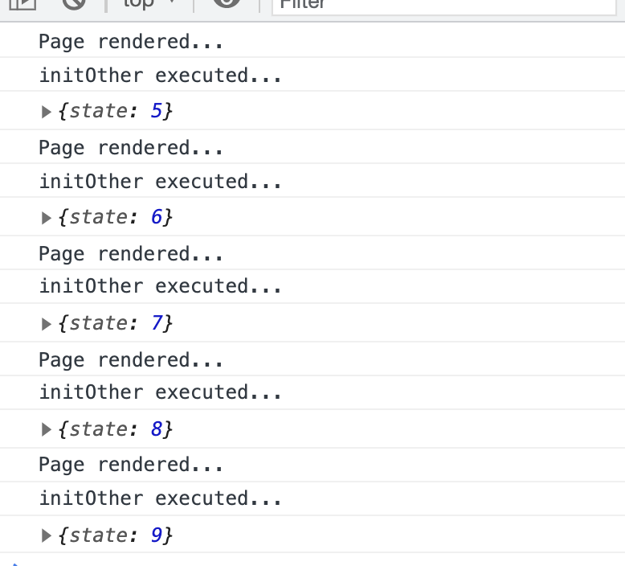

# useState  초기 값을 함수로 쓰고자할 때는 이렇게

```jsx
function initOther(initialOther?: number) {
  console.log("initOther executed...");
  return initialOther !== undefined ? initialOther + 1 : 0;
}
export default function Page({ initialOther }: { initialOther?: number }) {
  console.log("Page rendered...");
  const [state, setState] = useState(0);
  const [other, setOther] = useState(initOther(initialOther));
  useEffect(() => {
    console.log({ state });
  }, [state]);
  return (
    <Wrapper>
      <p>state:{state}</p>
      <p>other:{other}</p>
      <Button onClick={() => setState(state + 1)}>state + 1 업데이트</Button>
    </Wrapper>
  );
}
```

가끔 초기 값을 위해서 props를 바탕으로 어떠한 연산을 해서 주어야 할 때가 있습니다.

위의 예시에서는 `initialOther` 라는 옵셔널 프롭스를 받아서, 특정연산을 한뒤 초기값을 state에 할당해주는 함수 `initOther` 가 있습니다. 별문제 없어보이는 이 코드도 실은 렌더링마다 `initOther` 가 호출되는 좋지 못한 코드입니다.



오로지 state 라는 상태만 업데이트 시켰는데 initOther는 매번 실행되어요.

초기 값을 저렇게 함수를 이용하여 넣어주고 싶을 땐 다음과 같이하면 오로지 최초 한번만 실행됩니다.

```jsx
const [other, setOther] = useState(() => initOther(initialOther));
```


## References

[Hooks FAQ - React](https://reactjs.org/docs/hooks-faq.html#how-to-create-expensive-objects-lazily)
