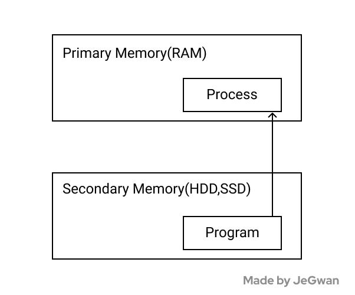

# Program, Process, Thread 그리고 Multi-processing, Multi-Theading

컴퓨터는 프로그램을 어떤 단위로 실행할까요? 이번 주제는 프로세스와 스레드입니다.

## Program 이란?

프로그램은 뭘까요? 우리는 일상 생활에서 크롬, 카카오톡, 워드 따위를 프로그램이라고 많이 불러왔습니다.
그런데 이런 일반적인 프로그램이라는 표현과 CS에서 말하는 프로그램의 정의가 미묘하게 다릅니다.

> 컴퓨터 프로그램은 컴퓨터에서 실행될 때 특정 작업(specific task)을 수행하는 **일련의 명령어들의 모음**

- Rochkind, Marc J. (2004). 《Advanced Unix Programming, Second Edition》. Addison-Wesley. 1.1.2쪽.

다시 말해 프로그램이란 만든 사람이 의도한 **코드들 자체**를 뜻합니다(물론 그 파일은 컴파일 되어 바이너리 파일일 수도 있습니다).

이것이 중요합니다! 프로그램은 작동을 지시하는 코드들일 뿐이고 이 자체로는 그냥 메모장으로 저장한 파일이나 다름 없습니다.

Program이란 우리가 작성한 소스코드 및 컴파일 된 실행코드 자체를 뜻한다!

### 이렇게도 생각해보세요 😉

요즘에서야 코딩이란 말이 많이 쓰이지만, 그전에는 Programming 한다고 했었잖아요?
Program을 만드는 행위 를 프로그래밍이라 했으니, 그에 대한 결과물이 자연히 프로그램이겠죠!

더 잘 기억될 것 같지 않나요!?

## Process 란?

프로세스는 프로그램을 구동시켜 실행한 작업 단위를 지칭합니다.

더 쉽게 말하면 **프로그램이 실행된 녀석** 이라고 볼 수 있습니다.

그래서 하나의 프로그램을 여러번 실행시키면, 여러개의 프로세스가 실행되고 있는 겁니다.

프로세스는 GUI 환경에서 눈에 보일 수도(foreground), 뒷단에서(background) 실행될 수도 있습니다.

여기까지 교양편이구요 ㅎㅎㅎ 이제 개발자로서 프로세스를 더 딥하게 살펴봅시다.

### 들어가기 전에. 코드 덩어리인 Program을 컴퓨터는 어떻게 실행시킬까?

컴퓨터는 결국 0과 1로 바이너리 계산만 하는 멍청한 녀석입니다.

사람인 우리가 읽기 좋게 만들어진 Programming language로 우리는 프로그램을 작성하고, 실행시킵니다.

이것이 결국 0과 1로 된 계산으로 바뀌어야 [프로그램 ⇒ 실행된 프로세스]가 되는 것이겠죠?

자 다음과 같은 과정이 있을겁니다.

1. 사람이 소스코드를 작성함
2. 고급진 우리가 쓰는 언어(High level, Programming language)를 멍청한 컴퓨터가 알아먹을 수 있는 언어(Low level, Machine Language)로 바꿔주는 통역사 같은 녀석(Compiler)이 해당 소스코드를 분석하고 미리 바이너리로 바꿔놓거나(컴파일 언어!), 아님 실행하면서(인터프리터 언어!) 필요할 때 바이너리로 바꿉니다.
3. 어찌 됐든, 우리가 실행할

   1. (컴파일 언어일 땐) 바이너리 코드
      이놈도 결국 기계어(machine language) 자체는 아닙니다. 가장 유사한 놈이지만, 실행을 위한 여러 메타 데이터들이 포함되어있고, 이 녀석이 실행되면서 최종적으로 cpu한테 기계어로 보내는 겁니다.
   2. (인터프리터 언어일 땐) 소스 코드
      우리가 프로그래밍 언어로 작성한 코드 자체입니다.

   이 두 녀석중에 하나를 메모리에 띄울 겁니다.

4. 그리고 기억하고 있을 변수나, 컨텍스트를 저장하기 위해 어떤 '저장 공간'이 필요합니다.

이제 그 '저장 공간'을 알아보러 가봅시다.

**잠깐 딴 얘기 : 컴파일 언어와 인터프리터 언어 예시**
Java와 Python을 생각해봅시다. Java는 프로그래밍해놓고 결국 실행파일로 컴파일 해야하죠?!
반면 Python은 그냥 짜놓은 것을 `python3 main.py` 따위로 실행할 수 있습니다.
그래서 Java는 컴파일 언어이고, 파이썬은 인터프리터 언어입니다.

**잠깐 딴 얘기 : RAM과 HDD**
역사를 거슬러서 우리가 0과 1로 계산하는 CPU를 만들었다 칩시다. 매번 0과 1로 명령을 내리는 것은 불편했을 것입니다. 그래서 사람이 보기 쉬운 언어로 작성을 한 다음 0과 1로 바꾸는 전략을 만들었습니다.
이것이 프로그래밍 언어 탄생의 배경입니다.

프로그래밍을 통해 만들어진 프로그램은 목적에 따라 다양하게 존재할 것입니다.
어느 순간 컴퓨터한테 일을 시키기 위한 여러가지 목적의 바이너리 코드가 넘쳐날 것입니다.
프로그램은 실행시에 내부의 컨텍스트에서 유지할 상태(변수) 따위가 있기 때문에 실행시키는 프로그램을 위한 저장공간이 필요합니다.

다음 필요성이 대두됩니다.

1. 실행 시킨 프로그램은 CPU에게 계산을 보내고 받는 속도가 빠른 메모리 영역을 썼음 좋겠다.
2. 실행 시키지 않을 프로그램은 굳이 빠른 메모리 영역을 사용할 필요는 없다.

이것이 주기억장치(Primary Memory, RAM)와 보조기억장치(Secondary Memory, HDD나 SSD)
주기억장치는 용량이 적은 대신 속도가 빨라서 프로그램을 실행시킨 프로세스를 놓는 공간으로 사용하고, 실행시키지 않는 프로그램 및 실행시킨 프로세스의 프로그램도 놓여질 위치가 보조기억장치입니다.

### Process 의 저장공간

프로세스는 프로그램을 실행시키기 위해 다음과 같은 독립된 메모리 영역(Code, Data, Stack, Heap의 구조)을 할당습니다.

1. Code : 우리가 작성한 코드가 올라가는 영역입니다.
2. Data : 글로벌 변수들이 올라가는 곳입니다.
3. Heap : 동적 메모리 영역입니다.
4. Stack : 지역변수, 매개변수, 반환값등 일시적인 데이터들이 여기 올라갑니다.

### Process간 통신 IPC

이처럼 독립적으로 돌아가는 프로세스는 서로 다른 메모리 영역을 가지므로, 한 프로세스가 다른 프로세스에 접근하기 위해서는 프로세스간 통신이 필요합니다. 파이프, 파일, 소켓등을 이용한 통신 방법이 있는데 이를 프로세스간 통신이라 하여 Inter Process Communication 즉, IPC라 부릅니다.

### Context Switching & CPU Core

CPU에는 코어가 있습니다. 코어 하나가 곧 계산을 수행하는 녀석들인데.

하나의 코어는 한번에 하나의 연산밖에 하지 못합니다.

우리가 여러 프로그램을 실행시킬 때 (프로세스가 여러개 띄워질 때)

동시에 프로그램들을 사용한다고 느끼지만(멀티 태스킹)

사실 짧게 CPU 가 처리하는 프로세스가 바뀌면서 동시에 실행하는 것처럼 보이는 것입니다.

이렇게 짧게 짧게 실행되는 프로세스가 바뀌는 것을 Context switching이라 합니다!

요즘엔 멀티코어가 CPU가 많아져서 동시 처리를 할 수 있게 되었습니다.

여기서의 동시 처리는, 병렬 처리(parallel processing) 할 수 있다는 말입니다.

## Thread 란?

스레드란 프로세스 내에서 실행되는 흐름의 단위를 지칭합니다.

프로세스는 최소 1개의 스레드(메인 스레드)를 가지고 있습니다.

스레드는 프로세스 내에서 각각 Stack만 따로 할당받고 프로세스의 Code, Data, Heap 영역은 공유합니다.

즉 하나의 프로세스가 3개의 스레드를 가지고 있다면, 각각이 스택을 다르게 가질 뿐, 프로세스의 Code, Data, Heap은 똑같이 바라보는 겁니다.

### Multi-threading 이란

프로세스가 여러개의 스레드로 구성되어 작업을 처리하는 것입니다.

**이렇게 하면 무엇이 좋을까요?**

- 프로세스의 Code, Data, Stack 영역을 공유하니 적은 메모리로 효율적으로 작업할 수 있습니다.
- 스레드간 Context Switching이 프로세스간 보다 빠릅니다. Stack 메모리 영역만 다르고 나머진 공유중이니까요!

**무엇이 안좋을까요?**

- 하나의 스레드에 문제가 발생하면 전체 프로세스가 영향을 받습니다.
- 디버깅이 까다롭습니다.
- 멀티 스레드의 경우 자원 공유의 문제가 발생합니다.

### Multi Processing 이란

하나의 프로그램을 여러 개의 프로세스로 구성하여 각각의 프로세스가 작업을 처리하도록 하는 것입니다.

이제 위에서 쓴 멀티 스레드와의 차이가 극명히 보이시죠!?

**이렇게 하면 무엇이 좋을까요?**

- 여러 개의 자식 프로세스 중 하나에 문제가 발생해도 그 자식 프로세스만 죽고, 다른 프로세스엔 영향이 가지 않습니다.(크롬은 탭 별로 별개의 프로세스로 운영하므로, 한 탭에서 멈추어도 다른 탭은 잘 실행됩니다)

**무엇이 안좋을까요?**

- 프로세스는 각각의 독립된 메모리 영역을 할당받았기 때문에 프로세스 사이에서 공유하는 메모리가 없습니다.
- 때문에 프로세스간 통신이 필요할 때 IPC를 해야합니다.
- Context Switching가 발생하면 RAM과 CPU 사이의 캐쉬메모리의 데이터를 리셋하므로 오버헤드가 아주 큽니다.
- 따라서 스레드간 Context Switching보다 느립니다!
