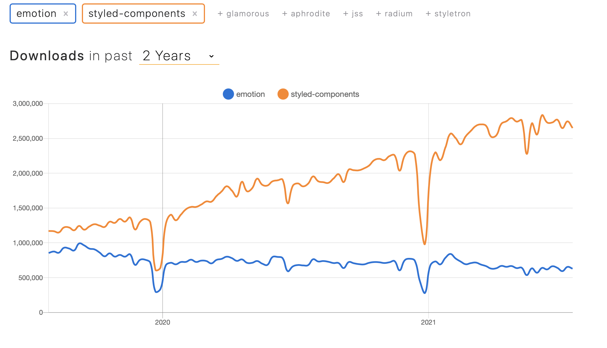
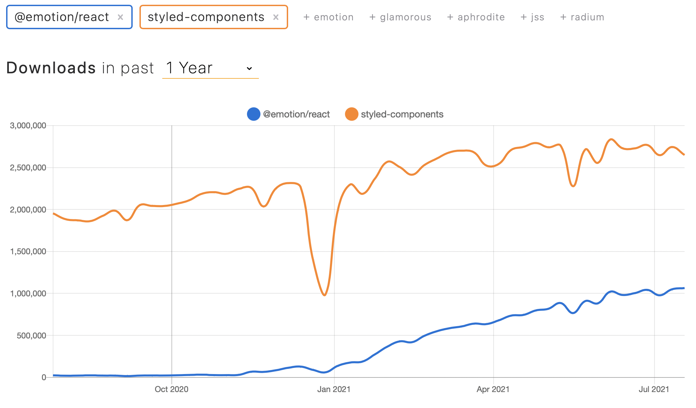
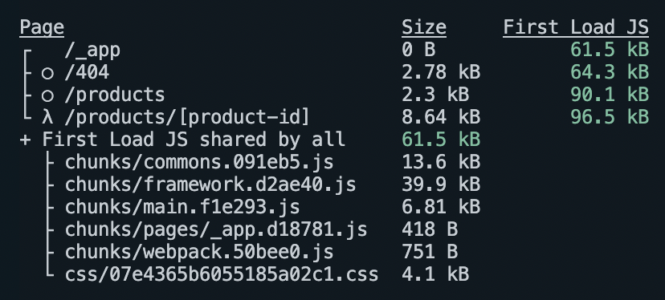

# Styling in JS

Created: July 24, 2021 9:27 AM
Tags: frontend, web


The first styling research- emotion vs styled-components


# Emotion vs Styled-components

Both libraries are created on the same year-2016, and Emotion is half year earlier.



## `@emotion/react` has dramatic increase over 2021 💪



### Styled-components

- The latest weekly downloads: 2,703,407
- **Unpacked Size: 1.15MB**
- Issues: 241
- Last publish: 3 months ago (05/05/2021)
- **Dependencies: 10**
  - @babel/helper-module-imports
  - @babel/traverse
  - **@emotion/is-prop-valid**
  - **@emotion/stylis**
  - **@emotion/unitless**
  - babel-plugin-styled-components
  - css-to-react-native
  - hoist-non-react-statics
  - shallowequal
  - supports-color

### Emotion

- The latest weekly downloads: 615,089
- **Unpacked Size: 5.95 kB**
- Issues: 105
- Last publish: 3 months ago (05/07/2021)
- **Dependencies: 0**

### @emotion/react (css composition style)

- The latest weekly downloads: 2,572,467
- **Unpacked Size: 513kB (2x lighter)**
- Issues: 105
- Last publish: 4 months ago
- **Dependencies: 7**
  - @babel/runtime
  - @emotion/cache
  - @emotion/serialize
  - @emotion/sheet
  - @emotion/utils
  - @emotion/weak-memoizehoist-non-react-statics

### @emotion/styled (styled API for @emotion/react)

- The latest weekly downloads: 1,105,828
- **Unpacked Size: 196kB**
  - But the @emotion/react needs to be installed, so the sum of size is >700kB
- Issues:
- Last publish: 3 months ago
- **Dependencies: 7**
  - @babel/runtime
  - @emotion/babel-plugin
  - @emotion/is-prop-valid
  - @emotion/serialize
  - @emotion/utils

## Getting know Emotion more

There are two primary methods of using Emotion.

- **Framework agnostic**- `@emotion/css`

  - The simplest way
  - No additional setup- babel plugin or other config
  - Auto vendor-prefixing, nested selectors, media queries
  - SSR is also possible with additional work to set up
  - Example

    ```jsx
    import { css, cx } from "@emotion/css";
  
    const color = "blue";
  
    render(
      <div
        className={css`
          &:hover {
            color: ${color};
          }
        `}
      >
        Hover to change color.
      </div>
    );
    ```

    [https://emotion.sh/docs/introduction](https://emotion.sh/docs/introduction)

- **Compose styles in React project**

  ```jsx
  /** @jsx jsx */
  import { jsx, css } from "@emotion/react";

  const base = css`
    color: hotpink;
  `;

  render(
    <div
      css={css`
        ${base};
        background-color: #eee;
      `}
    >
      This is hotpink.
    </div>
  );
  ```

  - Class priority is by specificity order. You don’t have to think about the order that styles were created because the styles are merged in the order that you use them.

    ```jsx
    render(
      <div>
        <style>
          {`
            .danger {
              color: red;
            }
            .base {
              background-color: lightgray;
              color: blue;
            }
          `}
          >
        </style>
        <p className="base danger">Show blue </p>
      </div>
    ```

- **Use with React**- `@emotion/react`

  - Requires React
  - `css` prop support
    - similar to the `style` prop, but also has auto vendor-prefixing, nested selectors, media queries
    - accepts a function that is called with your theme as an argument- easy access to common and customizable values.
  - SSR with no config
  - Theming
  - ESLint plugins
  - Example of `css` prop use

    ```jsx
    // this comment tells babel to convert jsx to calls to a function called jsx instead of React.createElement
    /** @jsx jsx */
    import { css, jsx } from "@emotion/react";

    const color = "blue";

    render(
      <div
        css={css`
          &:hover {
            color: ${color};
          }
        `}
      >
        Hover to change color.
      </div>
    );
    ```

  - Example of `styled.div` style

    ```jsx
    import styled from "@emotion/styled";
    
    const Button = styled.button`
      &:hover {
        color: white;
      }
    `;
    render(<Button>This my button component.</Button>);
    ```

## Does `@emotion/react` has the basic features of `styled-components`?

### **Passing Props**

**Styled-components:** `${props => props.blabla ... }` , and non-standard attributes are filtered as the passed props.

```jsx
const Button = styled.button`
  color: ${(props) => (props.primary ? "red" : "black")};
`;

const Input = styled.input`
  color: ${(props) => props.inputColor || "red"};
`;

render(
  <div>
    <Button>Normal</Button>
    <Button primary>Primary</Button>
    <Input defaultValue="abc" type="text" />
    <Input defaultValue="xyz" type="text" inputColor="blue" />
  </div>
);
```

**Emotion:** same

### **Extending Styles- Inheritance**

**Styled-components**: `styled(ParentComp)`

```jsx
const Button = styled.button`
  color: palevioletred;
  border: 2px solid palevioletred;
`;

const TomatoButton = styled(Button)`
  color: tomato;
  border-color: tomato;
`;

render(
  <div>
    <Button>Normal Button</Button>
    <TomatoButton>Tomato Button</TomatoButton>
  </div>
);
```

**Emotion**: same

### **Extending Styles- Polymorphic prop**

**Styled-components**: `as` prop. It also works with custom components as well.

```jsx
<Button as="a" href="#">Link with Button styles</Button>
<TomatoButton as="a" href="#">Link with Tomato styles</TomatoButton>
```

**Emotion**: same, but it seems there's a bug with typescript: [https://github.com/emotion-js/emotion/issues/2266](https://github.com/emotion-js/emotion/issues/2266) (Feb 23), [https://github.com/emotion-js/emotion/issues/2434](https://github.com/emotion-js/emotion/issues/2434) (11d ago)

### **Styling any component**

**Styled-components**: passing `className` prop

```jsx
const Link = (
  { className, children } // both params are optional
) => <a className={className}>{children}</a>;

const StyledLink = styled(Link)`
  color: red;
`;

render(
  <div>
    <Link>Unstyled, boring Link</Link>
    <br />
    <StyledLink>Styled, exciting Link</StyledLink>
  </div>
);
```

**Emotion:** same

### **Lazy Keyframe injection**

**Styled-components**: `keyframes` helper

CSS animations with `@keyframes` are scoped to be global, so you want to avoid name collisions. The `keyframes` helper generates a unique instance, and the keyframes are lazily injected when they're used.

### Targeting another component

**Both**: `${TheComp}`

```jsx
const Child = styled.div`
  color: red;
`;
const Parent = styled.div`
  ${Child} {
    color: green;
  }
`;
```

### Nesting components

**Both**: they offer `&` selector

### Test

**Styled-components**

FCP: 886.5 ms



**Emotion/react**

FCP: xms

picture

## So why people don't use `Emotion` ?

### DX Winner `styled-components`

**People love easy-to-use, and the `styled-components` fulfills it.**

The `styled-components` has enough description on each basic feature with example code. It's easy and fast to read. However, `Emotion` is tough for "css-in-js" beginners and its description is pretty shortened.

And the `Emotion` document I read is `Getting Started/Styled Components`, but it's a bit close to the "Advanced feature". It would've been better if it contained only necessary info to try to use this library. For example I wouldn't want to know object-ish styling.

Is `Emotion` really light when we grab the developer experience?

@emotion/server @emotion/react @emotion/styled and babel plugin...

# Reference

[https://www.npmjs.com/package/emotion](https://www.npmjs.com/package/emotion)

[https://www.npmjs.com/package/styled-components](https://www.npmjs.com/package/styled-components)

[https://styled-components.com/docs/basics](https://styled-components.com/docs/basics)

[https://emotion.sh/docs/introduction](https://emotion.sh/docs/introduction)

[https://emotion.sh/docs/styled](https://emotion.sh/docs/styled)
