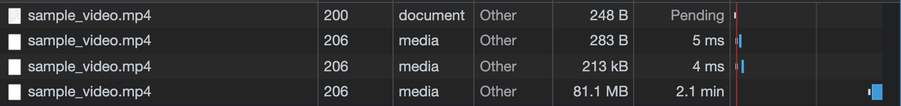

a# Video Streaming

Nginx is commonly used as a static file server because it can serve static files with better performance when compared to Apache. If you want to serve a static file simply and quickly, you can configure Nginx like this: 

```
server {
    listen 8089;
    
    location / {
        alias /file/path/to/the/static/files/folder/;
    }
}
```

Put in a sample video file in the "/file/path/to/the/static/files/folder" folder, go to [http://localhost:8089/file_name](http://localhost:8089/file_name). Voila! you can serve the static file in your local file system now.

However, this approach is not suitable for serving video files for the following reasons:

1. **The whole video is downloaded in one request**

Below is a screenshot of a request for a video in the network tab within the chrome debugger. You can see that a connection was opened through the first request with a response status of 200 and the video was handled by three requests with a response status 206(Partial Content) following the 200.



The actual video file was downloaded through the last request with a total response size of 81.1MB! Even if the user pauses the video or does not really need the whole video, the server still sends the entire file, which can take up a lot of hardware and network resources.

**2. It's vulnerable to coarse network status**

Not everybody has a 1GB/s internet speed. Depending on the internet service, wifi signal strength, and overall network environment, some users might need to watch the video at a lower quality. However, our Nginx server has only one video file with a fixed bitrate and it only knows which port to listen to and which file to serve for a request coming through that port.

### Adaptive Bitrate Streaming (ABR)

Adaptive Bitrate Streaming was devised as a solution for the problems mentioned above. It serves multiple small fractions of a video instead of sending the whole file through a long-hanging request. Additionally, it can send different quality videos depending on the client's processor capacity and network bandwidth. There are different ABR protocols such as Apple's HTTP Live Streaming(HLS), Microsoft's Smooth Streaming(MSS), MPEG-DASH, and Adobe's HTTP Dynamic Streaming. 

### HTTP Live Streaming(HLS)

HLS is one of the most widely used ABR protocols released by Apple in 2009. In order to serve a file in HLS protocol, the server needs to go through some preparations.

- Encoding
HLS only supports H.264 or H.265(HEVC) encoding. If the video file is in a different format other than H.264 and H.265, you must first encode it into one of them.
- Segmenting
Segmenting means splitting the file into small fractions grouped into different qualities. You can configure the length of each fraction (usually 2 ~ 10 seconds) and the qualities to support (144p, 360p, 720p, 4k, etc). The segmented files are stored in either fMP4(extension: mp4) or MPEG-2 transport stream(extension: ts) format. An index(playlist) file with an extension of m3u8 must be created as well.

*Difference between video container(avi, mp4, mov...) and codec(h264, MPEG4)

The client needs to make a request for the playlist file first. Below is an example of an m3u8 file.

```
#EXTM3U
#EXT-X-PLAYLIST-TYPE:VOD
#EXT-X-TARGETDURATION:10
#EXT-X-VERSION:4
#EXT-X-MEDIA-SEQUENCE:0
#EXTINF:10.0,
http://example.com/movie1/fileSequenceA.ts
#EXTINF:10.0,
http://example.com/movie1/fileSequenceB.ts
#EXTINF:10.0,
http://example.com/movie1/fileSequenceC.ts
#EXTINF:9.0,
http://example.com/movie1/fileSequenceD.ts
#EXT-X-ENDLIST
```

Actual implementation of HLS on the server side will be continued in the next part.

Sources 
[https://datatracker.ietf.org/doc/html/rfc8216](https://datatracker.ietf.org/doc/html/rfc8216)

[https://www.cloudflare.com/ko-kr/learning/video/what-is-http-live-streaming/](https://www.cloudflare.com/ko-kr/learning/video/what-is-http-live-streaming/)

[https://developer.apple.com/documentation/http_live_streaming/hls_authoring_specification_for_apple_devices](https://developer.apple.com/documentation/http_live_streaming/hls_authoring_specification_for_apple_devices)
[https://www.youtube.com/watch?v=Z3eRwICG4OU](https://www.youtube.com/watch?v=Z3eRwICG4OU)

[https://developer.apple.com/streaming/examples/](https://developer.apple.com/streaming/examples/)